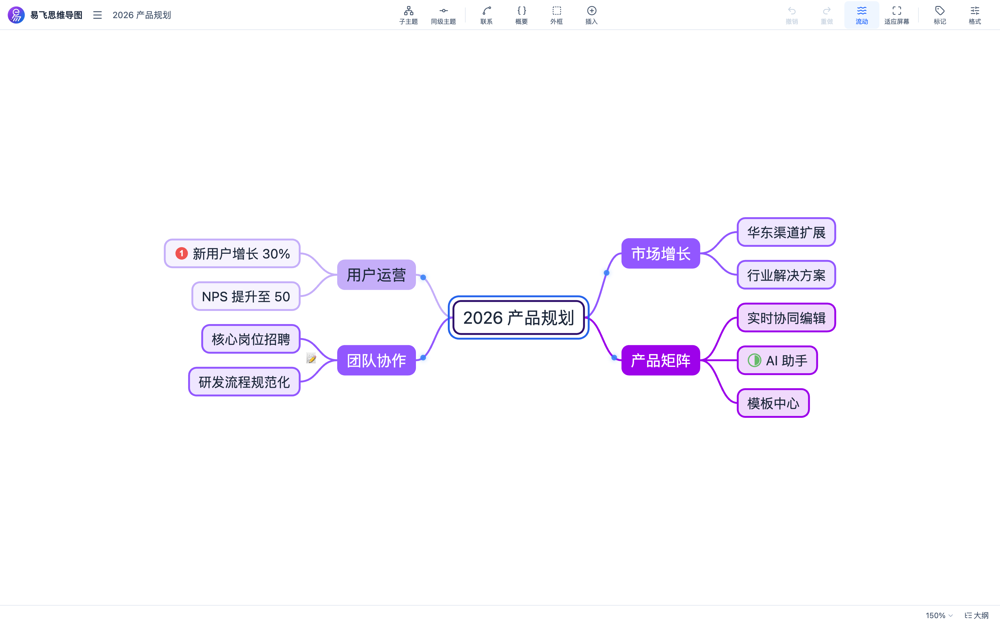
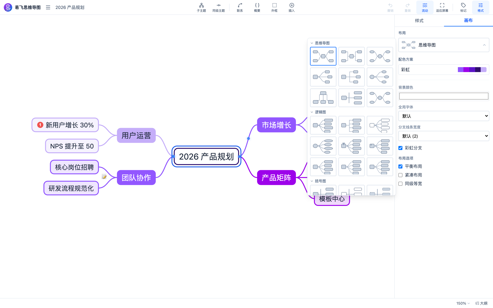

# EFLink MindMap 易飞思维导图

开箱即用的在线思维导图编辑器。基于 [Konva](https://konvajs.org/) 画布引擎与 React 构建，**既可以独立运行（本仓库 demo 应用），也可以作为 React 组件嵌入任意应用**（npm 包 `@eflink-tech/mindmap`）。

A mind map editor for the web. Run it standalone, or embed `<MindMapEditor />` into your React app.

## 截图预览

| 思维导图画布 | 布局与配色 | 大纲视图 |
| --- | --- | --- |
|  |  |  |

## 功能特性

- 画布引擎：Konva + react-konva，无限画布、缩放平移、小地图导航
- 布局算法：思维导图 / 逻辑图 / 组织结构图 / 括号图 / 时间轴，一键切换自动重排
- 节点能力：多级主题、拖拽调序、节点样式（圆角/椭圆/矩形/六边/胶囊）、笔记 / 标签 / 链接 / 图片
- 连接能力：联系线（曲线/直线/折线/括号线 + 箭头）、节点概括（Summary）与边界（Boundary）标注
- 标记系统：优先级 / 星级 / 表情 / 贴纸等标记，按面板一键应用
- 主题配色：内置多套配色方案（对齐 XMind 34 套缤纷色板），节点文字色按填充亮度自适应
- 大纲视图：画布 / 大纲双模式切换，列表内直接编辑层级
- 编辑能力：撤销重做、快捷键体系（导航 / 编辑 / 缩放）、双击编辑、文字按填充自适应
- 持久化：IndexedDB（Dexie）自动保存，刷新后自动恢复上次文档；文档重命名 / 删除 / 列表管理
- 导出：`.efm` JSON 文档 + 画布 PNG 图片
- 工程化：Vite + TypeScript + Vitest 单测 + Playwright e2e + OxLint

## 使用组件

```bash
npm install @eflink-tech/mindmap
```

```tsx
import { MindMapEditor } from '@eflink-tech/mindmap';
import '@eflink-tech/mindmap/styles.css';

function Page() {
  return (
    <div style={{ width: '100vw', height: '100vh' }}>
      <MindMapEditor />
    </div>
  );
}
```

组件自带完整编辑器 UI（顶部工具栏、格式 / 标记面板、状态栏），挂载后自动恢复上次编辑的文档，无需任何配置。

### 导出面

- `MindMapEditor`：编辑器组件（零配置，挂载即用）
- `useMindMapStore`：文档状态（节点树、选中集、视口），可用于程序化操作导图
- `useUiStore` / `useDocumentsStore`：面板 / 视图状态与文档列表管理
- `db, saveDocument / loadDocument / listDocuments / deleteDocument / renameDocument`：IndexedDB 持久化辅助
- `createDocument`：创建空白文档数据
- `MindMapDocument / MindMapNode / DocumentMeta`：文档数据模型

> **Tailwind 说明**：组件库内部布局用到少量 Tailwind 工具类（已随 `styles.css` 提供回退样式）。若宿主使用 Tailwind v4 且希望得到与 demo 一致的布局，请在入口 CSS 中显式扫描组件包：
>
> ```css
> @import "tailwindcss";
> @source "../node_modules/@eflink-tech/mindmap";
> ```

## 本地运行 Demo

```bash
pnpm install
pnpm dev          # 并行：组件库 watch 构建 + demo dev server
# 或
pnpm dev:demo     # 仅 demo（直连组件库源码，无需先构建）
```

打开终端提示的地址即为完整独立应用：布局切换、标记、配色、大纲、PNG 导出、自动保存，开箱即用。

## 命令速查

```bash
pnpm lint         # OxLint（monorepo 全量）
pnpm typecheck    # TypeScript 类型检查
pnpm test         # Vitest 单元测试
pnpm build        # 构建组件库 + demo
pnpm test:e2e     # Playwright 端到端（生产构建 + preview）
```

## 目录结构

```
eflink-mindmap/
├── packages/mindmap/   # @eflink-tech/mindmap 组件库（开源主体）
│   └── src/
│       ├── components/ # UI 组件（画布渲染、工具栏、面板、大纲、浮层编辑器）
│       ├── core/       # 编辑器内核（布局策略、节点操作、标记、快捷键、导出、持久化）
│       ├── store/      # zustand 状态（文档 / UI / 文档列表）
│       └── types/      # 数据模型
├── apps/demo/          # 独立 demo 应用（易飞思维导图）
├── e2e/                # Playwright 端到端测试
└── scripts/            # CI 发布辅助脚本
```

## 发版流程

使用 [Changesets](https://github.com/changesets/changesets) 管理版本：

```bash
pnpm changeset    # 记录变更（选择包与版本级别）
git push          # 推送后机器人自动开 Version PR
# 合并 Version PR → 自动发布 npm 并打 tag
```

## 联系我们

- **在线体验**：<https://eflink.tech>（易飞思维导图 · 免费在线思维导图）
- **问题反馈与交流**：[eflink.tech/contact](https://eflink.tech/contact)
- **邮箱**：[support@eflink.tech](mailto:support@eflink.tech)

扫码添加企业微信、关注微信公众号（二维码长期有效）：

<table align="center">
  <tr>
    <th>企业微信（扫码添加）</th>
    <th>微信公众号（扫码关注）</th>
  </tr>
  <tr>
    <td align="center"></td>
    <td align="center"></td>
  </tr>
</table>

## License

[Apache-2.0](./LICENSE)
